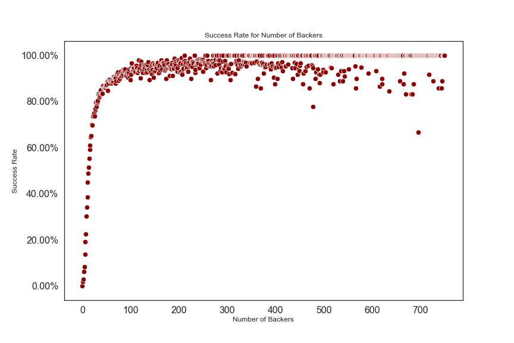

# KICKSTARTER - Predicting Campaign Success 
** A classification problem**

This is a small Data Science project as part of the Data Science bootcampt [neuefische](https://github.com/JonJae/nf_1st_project/blob/master/neuefische.de), Fall 2020.  The main aim of this project are a throughout Exploratory Data Analysis and the construction and validation of various Machine Learning Classification Models. 

## Business Context  

In recent years, the range of funding options for projects created by individuals and small companies has expanded considerably. In addition to savings, bank loans, friends & family funding and other traditional options, crowdfunding has become a popular and readily available alternative. Kickstarter, founded in 2009, is one particularly well-known and popular crowdfunding platform. A huge variety of factors contribute to the success or failure of a project. Some of these can be quantified or categorized, which allows for the construction of a machine learning model to attempt to predict whether a campaign will succeed or not.

## Project Structure 

- [SuccessPrediction_presentation.pdf](SuccessPrediction_presentation.pdf) presentation deck as PDF for non-technical stakeholders´
- [SuccessPrediction_EDA.ipynb](SuccessPrediction_EDA.ipynb) Exploratory Data Analysis notebook incl. Data Cleaning, Feature Engneering and Visualisation (PEP8, technical audience)
- [SuccessPrediction_ML.ipynb](SuccessPrediction_ML.ipynb) Machine Learning notebook incl. Models, Visualisation on findings and recommendations (PEP8, technical audience)
- [df_model.pkl](df_model.pkl) cleaned data as pickel data file

## Data Exploration - Key Findings

**Synthetic cap of number of occurrences** at about 2400 projects in an Subcategory. 

**Success by Subcategory** is very different for the most frequent subcategories

**The number of backers** has a great correlation to the successrate

## Models 

This project focuses on the **F1-Score** as target metric. Evaluated Models and their F1 Score: 

- **Random Forrest**: 0.81

- **XGBoost**: 0.8
- **SVM**: 0.69
- **Logistic Regression**: 0.78

**Feature Importance** for Random Forrest

## Conclusion

The Random Forrest model performes slightly better as the XGboost model, with an f1-score of 0.81 and slighly better computation time of XGboost. As for the features: The category has the greatest influence on the success of a project. As part of the EDA,  the `median_avg_pledge_per_backer_in_subcat` feature is designed. This feature gives an understanding of how much money the average backer in an sub category is willing to back a project. This has great influence on the success rate of a project. 

## Future Work

- Feature Engneering: **Average USD-Pledge per Subcategory** to evaluate better supported subcategories.
- **ROC Curve**s are another way to illustrate the  performance of a specific model. Compared to the F1-Score, ROC Curves  contain more information and, hence, generate a deeper understanding of  the model's performance. They are especially great for investigating and comparing different models.  Besides, ROC curves are a great tool for  communicating results. Hence, in future work, ROC curves should generate a deeper understanding of the model's performance.
- The used **confusion matrix** fulfills its purpose:  comparing the predicted and actual successes and failures. The  color-coding is a great addition as it shows the severity of various  values at a glance. Nevertheless, percentage values and labeling would  be a great addition and is part of future work.
- Aiming for the stars: The **blurb** (a string description) and the **photo** (mostly different versions of the main image) have been droped in the  current analysis earlie on. Splitting the blurb into its fragments could potentially surface a corrolation between success and metaphorical,  postive words. In addition, Analysing the images, e.g., for items or for color palets, could bring great insights and be a very steep but  rewarding learning curve.

## Data Source

The data was crawled by the company [WebRobots](https://webrobots.io/) ('We provide B2B web crawling and scraping services') directly from the [Kickstarter-Website](https://www.kickstarter.com/). At the point of writing, crawled data includes data  within the timeframe 2014-04-22 to 2020-08-13. 
